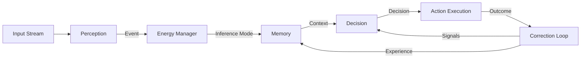
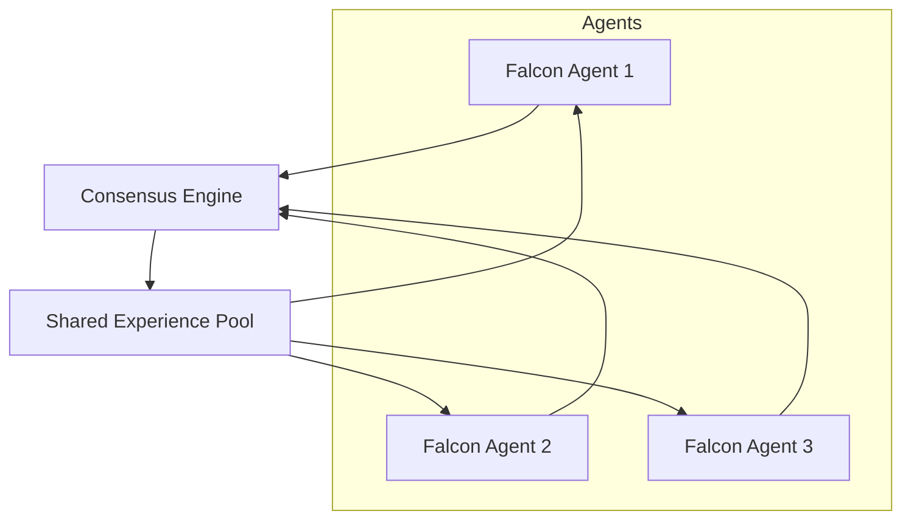
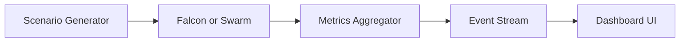

# Architecture Diagrams

## Pipeline

```mermaid
flowchart LR
  A[Input Stream] --> B[Perception]
  B -->|Event| C[Energy Manager]
  C -->|Inference Mode| D[Memory]
  D -->|Context| E[Decision]
  E -->|Decision| F[Action Execution]
  F -->|Outcome| G[Correction Loop]
  G -->|Signals| E
  G -->|Experience| D
```

## Swarm Consensus

```mermaid
flowchart TB
  subgraph Agents
    A1[Falcon Agent 1]
    A2[Falcon Agent 2]
    A3[Falcon Agent 3]
  end
  A1 --> C[Consensus Engine]
  A2 --> C
  A3 --> C
  C --> D[Shared Experience Pool]
  D --> A1
  D --> A2
  D --> A3
```

## Dashboard Flow

```mermaid
flowchart LR
  S[Scenario Generator] --> P[Falcon or Swarm]
  P --> M[Metrics Aggregator]
  M --> SSE[Event Stream]
  SSE --> UI[Dashboard UI]
```
